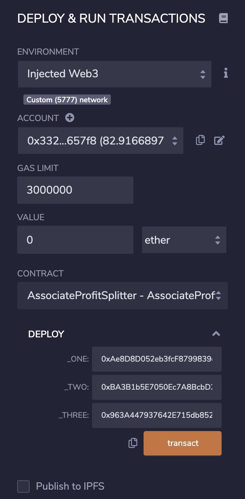
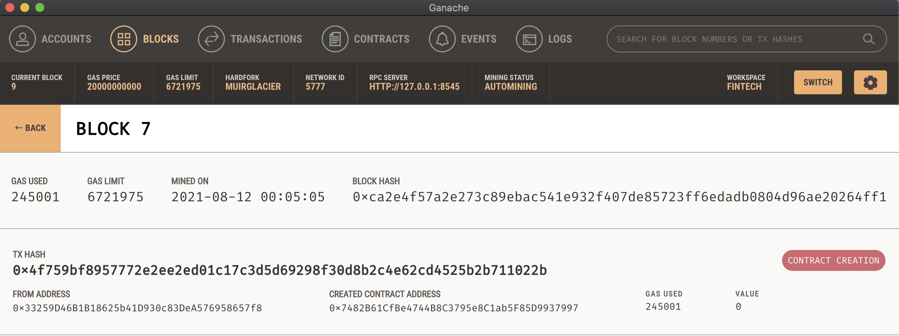
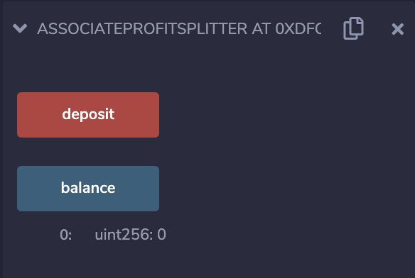
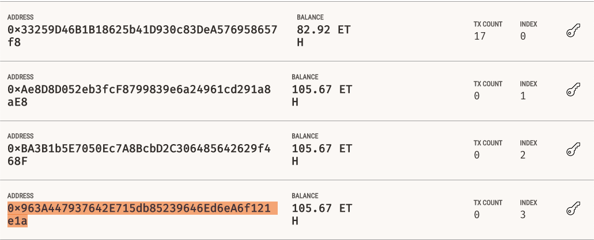

# smart-contract-homework

# Profit Splitter Smart Contract Using Solidity

#### AssociateProfitSplitter.sol is a Smart Contract that acts as a vehicle to distribute profits between employees of a company.
---
### Here's a brief summary of how it works:

1. Once you're done creating your Solidity Smart Contract you want to deploy it along with the wallet addresses of your employees. In this example I used three addresses. You also want to make sure you deploy your contract without adding a Value yet. 

2. When the contract is deployed, it will also create a contract address if successful:

3. Once the contract is deployed successfully, now you're going to select the wallet address that includes the money you will send and split equally between your employees. Specify how much in total you'd like to send in the Value field - then click deposit under your deployed contracts.

4. Lastly, once the contract runs you should now see your employees funds have been successfuly deoposited into their wallet addresses.

