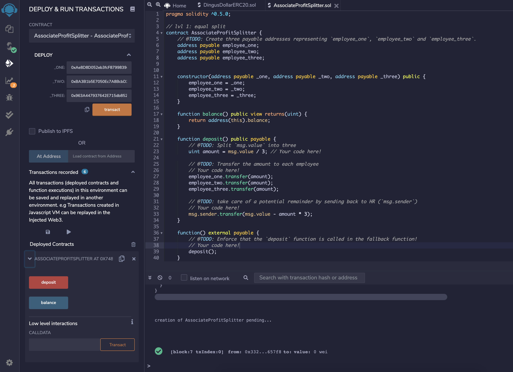

# smart-contract-homework

# Profit Splitter Smart Contract Using Solidity

#### AssociateProfitSplitter.sol is a Smart Contract that acts as a vehicle to distribute profits between employees of a company.
---
### Here's a brief summary of how it works:
1. Create your Smart Contract using the Remix IDE:

> remix.ethereum.org
2. Once you're done creating your Solidity Smart Contract you want to deploy it onto your blockchain along with the wallet addresses of your employees.(I am using Ganache connected with MetaMask) In this example I used three addresses. You also want to make sure you deploy your contract without adding a Value yet. 
>trufflesuite.com/ganache

>metamask.io

3. Once the contract is deployed, it will create a contract address if successful:

4. Once the contract is deployed successfully, you're going to select the main wallet address that includes the money you will send to your employees. Specify how much in total you'd like to send in the Value field - then click deposit under your deployed contracts:

5. Lastly, once the contract runs you should now see your employees funds have been successfuly deoposited into their wallet addresses:

